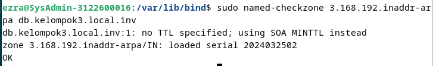
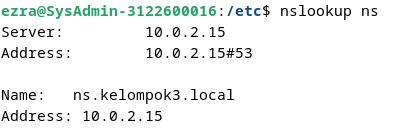

    NRP   : 3122600004
    Nama  : Rizal Maulana
    Kelas : 2 D4 IT A
    Dosen : Dr. Ferry Astika Saputra, ST, M.Sc

# DNS Setup in Debian

1. Buka Terminal kemudian ketikkan sudo apt install bind9 bind9-doc bind9-dnsutils untuk menginstall keperluan pembuatan DNS
2. Setelah mendownload, ketikkan cd /etc/bind untuk masuk ke direktori bind, kemudian cek file named.conf,  named.conf.options , named.conf.local,
apakah tersedia pada direktori tersebut menggunakan ls -al
3. Setelah itu config untuk 3 file yang ada direktori bind menggunakan command sudo nano (namafile)

   **named.conf:**
   
          acl internals { 127.0.0.0/8; 192.168.0.0/16; }; // untuk 192.168.0.0 sesuaikan dengan IP device (dhclient -v) x.x.0.0
          include "/etc/bind/named.conf.options";
          controls {
                  inet 127.0.0.1 port 953 allow { 127.0.0.1; };
          };
          include "/etc/bind/named.conf.local";
          include "/etc/bind/named.conf.default-zones";

   **named.conf.options:**

          options {
            directory "/var/cache/bind";
            forwarders {
                        202.9.85.3;
                        202.9.85.4;
            }; // sesuaikan dengan forwarder berdasarkan IP yang kamu dapat
        
            auth-nxdomain no;    # conform to RFC1035
            dnssec-validation auto;
            listen-on-v6 { none; };
            listen-on { 127.0.0.1; 192.168.3.10; }; // sesuaikan dengan IP yang akan dijadikan domain
            allow-transfer { none; };
            allow-query { internals; };
            allow-recursion { internals; };
            version none;

     **named.conf.local:**

            zone "kelompok3.local" {
                    type master;
            };
            
            zone "3.168.192.in-addr.arpa" { // kebalikan dari IP semisal IP 192.168.3.10 yang ditulis jadi 3.168.192 tanpa 10
                    type master;
                    file "/var/lib/bind/db.kelompok3.local.inv";
            };

4. Setelah mengubah 3 file di atas, lakukan cd /var/lib/bind dan lakukan sudo nano db.kelompok3.local dan sudo nano db.kelompok3.local.inv, berikut konfigurasi
   2 file tersebut:

   **db.kelompok3.local:**

           $TTL    3600
        @       IN      SOA     ns.kelompok3.local. root.kelompok3.local. ( // sesuaikan dengan nama DNS yang dibuat
                           2024031901           ; Serial // sesuaikan dengan tanggal dibuatnya DNS
                                 3600           ; Refresh [1h]
                                  600           ; Retry   [10m]
                                86400           ; Expire  [1d]
                                  600 )         ; Negative Cache TTL [1h]
        ;
        @       IN      NS      ns.kelompok3.local.
        @       IN      MX      10 ns.kelompok3.local.
        
        ns      IN      A       192.168.3.10 // sesuaikan dengan nama IP mu
        
        www     IN      CNAME   ns
        mail    IN      CNAME   ns

   **db.kelompok3.local.inv**

           $TTL    3600
        @       IN      SOA     ns.kelompok3.local. root.kelompok3.local. (
                           2024031902           ; Serial // sesuaikan dengan tanggal dibuatnya DNS
                                 3600           ; Refresh [1h]
                                  600           ; Retry   [10m]
                                86400           ; Expire  [1d]
                                  600 )         ; Negative Cache TTL [1h]
        ;
        @       IN      NS      ns.kelompok3.local.
        
        10       IN      PTR     ns.kelompok3.local.

5. Setelah melakukan konfigurasi, lakukan sudo nano named-checkzone kelompok3.local db.kelompok3.local dan sudo named-checkzone 136.168.192.inaddr-arpa db.kelompok3.local.inv untuk memastikan tidak ada sintaks yang salah pada pembuatan DNS

6. Setelah itu cek apakah domain sudah terbentuk atau belum menggunkaan nslookup ns

   
      

   