`Tugas ini merupakan tugas mata kuliah Konsep Jaringan yang dibimbing oleh Bpk. Dr. Ferry Astika Saputra,ST, M.Sc`

## Table of Contents
- [NTP Client](#installing-ntp-client)
- [Apache-FM](#install-apache-fm)
- [PHP 8.2](#install-php-8.2)
- [MariaDB](#install-mariadb)
- [Email System](#email-system)
- [Dovecot Server](#install-dovecot-server)
- [Final Check](#last-check)

# Installing NTP Client

Lakukan instalasi paket layanan sinkronisasi waktu

Pastikan konfigurasi timezone ke Asia/Jakarta

Melakukan konfigurasi Real Time Clock (RTC) untuk merefer ke UTC (Coordinated Universal Time)

Mengaktifkan NTP Client untuk sinkronisasi waktu

Menyunting file timesyncd.conf untuk mengarah ke NTP server terdekat untuk mendapatkan waktu 
delay terpendek. Biasanya setiap organisasi atau negara mempunyai NTP Server sendiri

Restart layanan sinkronisasi waktu dan pastikan layanan berjalan dengan benar

# Install Apache-FM

Installing Apache2

Konfigurasi Apache2

`nano /etc/apache2/conf-enabled/security.conf`

`line 12 : change`

`ServerTokens Prod`

 

`nano vi /etc/apache2/mods-enabled/dir.conf`

`add file name that it can access only with directory's name`

`DirectoryIndex index.html index.htm`

 

`nano /etc/apache2/apache2.conf`

`line 70 : add to specify server name`

`ServerName www.kelompok3.com`

 

`nano /etc/apache2/sites-enabled/000-default.conf`

`line 11 : change to webmaster's email`

`ServerAdmin webmaster@kelompok3.com`

`systemctl reload apache2`

Test ke web browser

# Install PHP 8.2

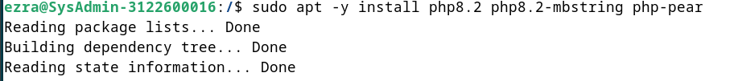

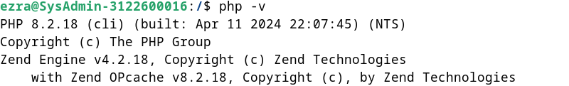

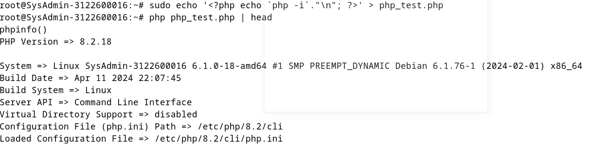

# Install PHP-FM

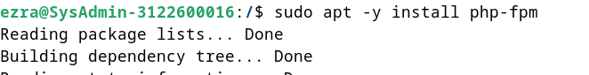

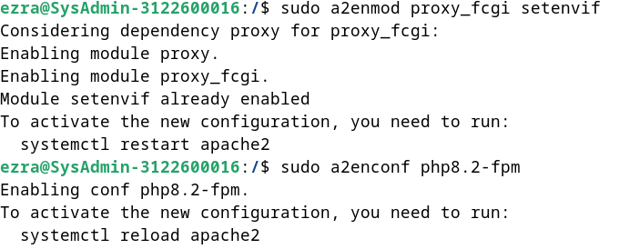

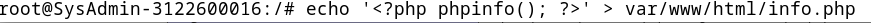

# Install MariaDB

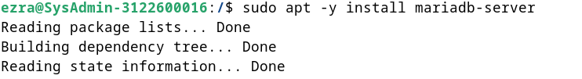

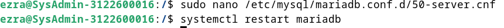

# Email System

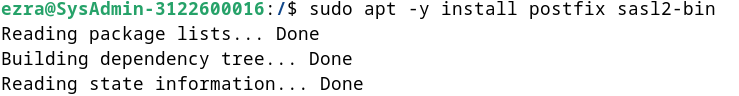

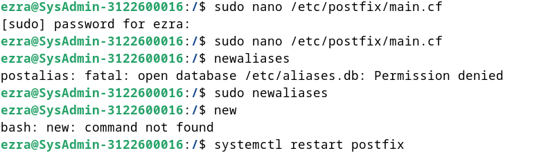

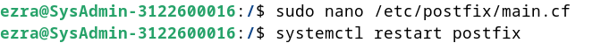

# Install Dovecot Server

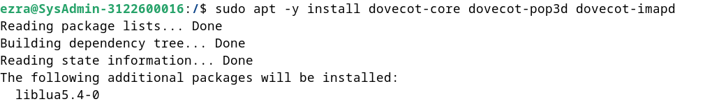

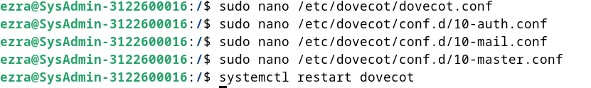

## Last Check

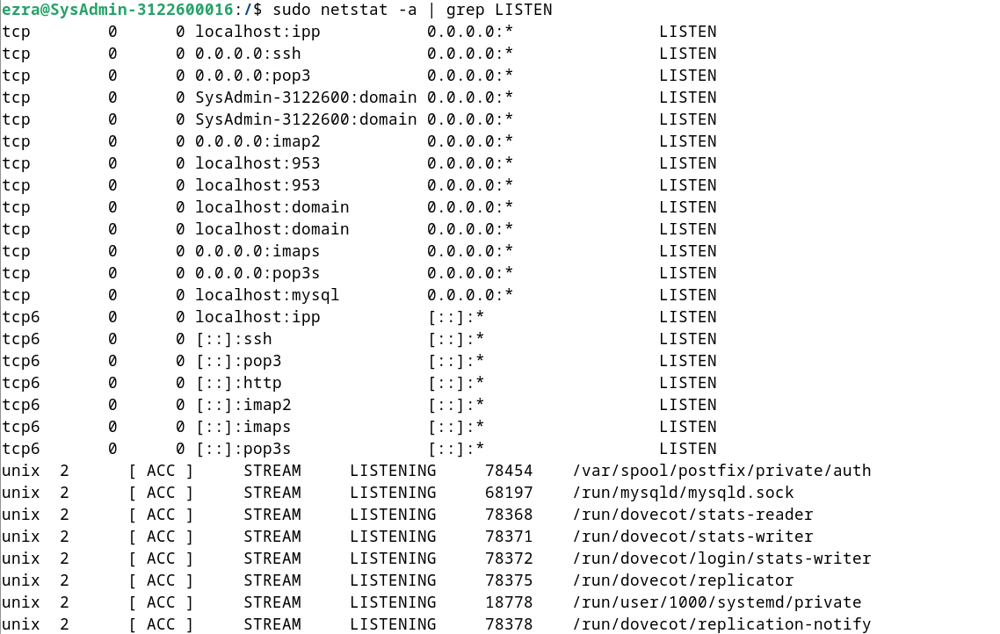

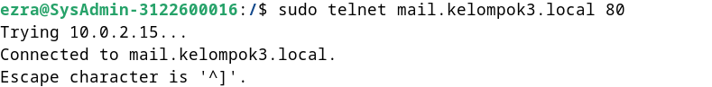