    NRP   : 3122600004
    Nama  : Rizal Maulana
    Kelas : 2 D4 IT A
    Dosen : Dr. Ferry Astika Saputra, ST, M.Sc

## Docker 101 Tutorial Playground

Tutorial dalam membangun sebuah container untuk aplikasi sederhana

1. kunjungi website https://www.docker.com/101-tutorial/, kemudian login dan masuk ke link play with docker https://labs.play-with-docker.com/

2. jalankan kode berikut 
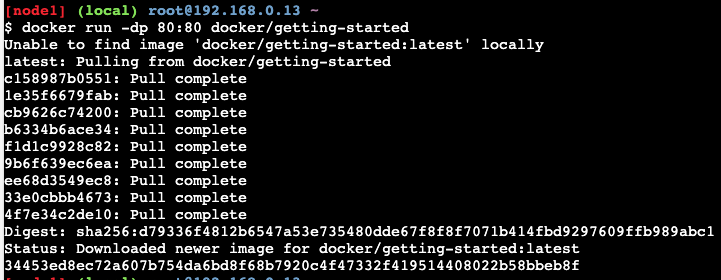

3. akan muncul akses tutorial seperti ini di port 80
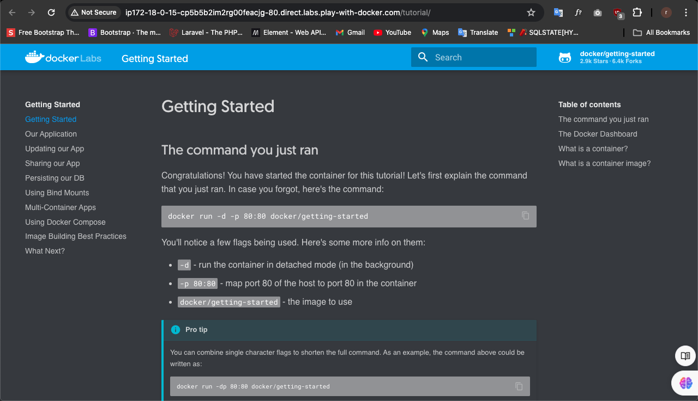

4. kemudian download file yang ada di tutorial

5. kemudian drag and drop ke labs play-with-docker, lalu coba klik editor jika berhasil maka terdapat file app.zip 
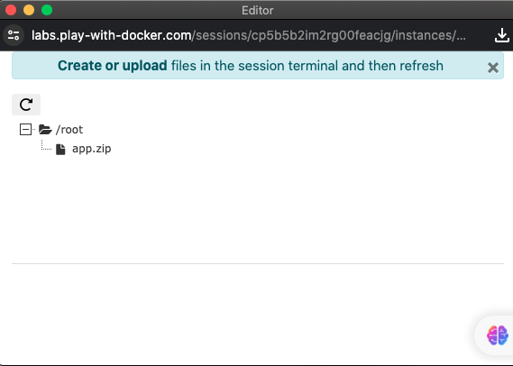

6. kemudian unzip file zip 
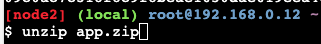

7. kemudian bisa lakukan pengecekan
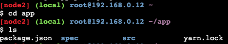

8. selanjutnya jika sudah berhasil kalian buat Dockerfile seperti ini 
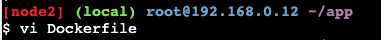
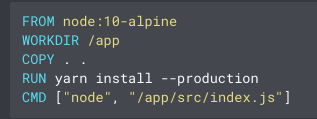

9. setelah disimpan kemudian jalankan dockernya

10. kalian bisa akses aplikasi todo list sederhana ini di port 3000
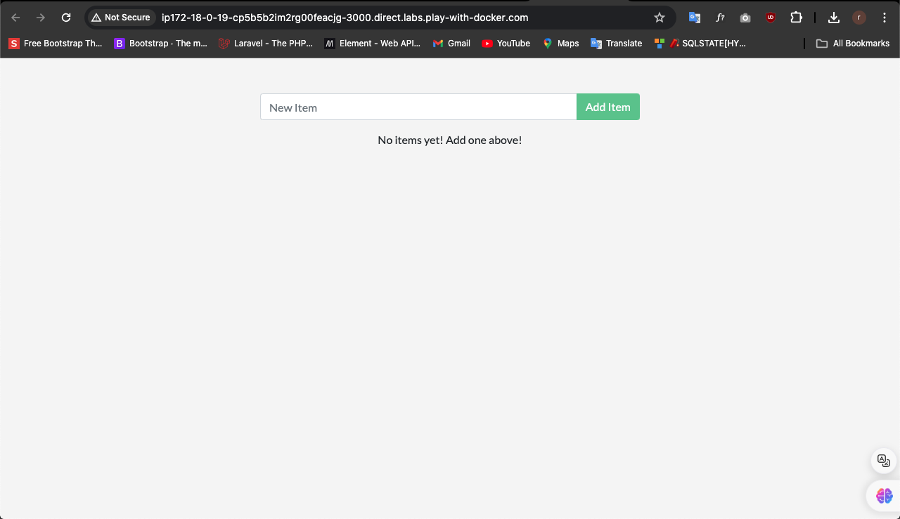

11. kemudian kita coba lakukan perubahan di file app/src/static/js/app.js,
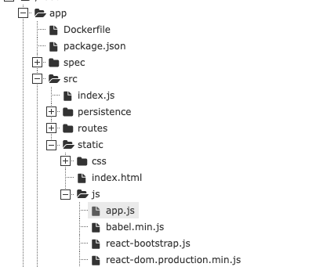
kemudian lakukan perubahan html
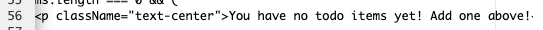
dan jalankan kembali 
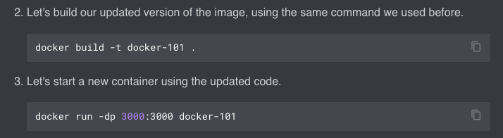
pasti akan terjadi error seperti dibawah karena sejatinya service kita sebenarnya belum terupdate sepenuhnya
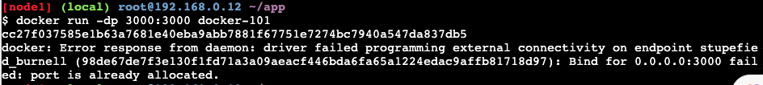

12. jalankan kode dibawah untuk mendapatkan container id
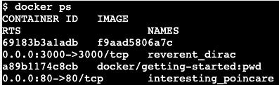
jalankan kode docker stop
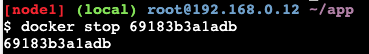
jalankan kode docker rm
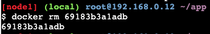
dari sini service container kita bisa sepenuhnya terupdate dengan menjalankan kode yang sama seperti diatas 
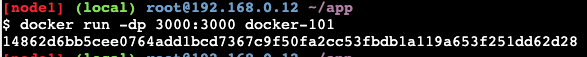

13. kemudian pergi ke docker hub untuk membuat sebuah repo, beri nama sesuai tutorial

14. kemudian kembali ke terminal lakukan login dan push ke repo
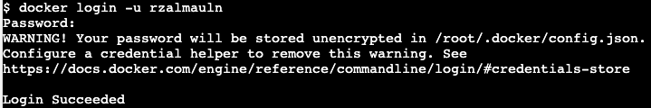
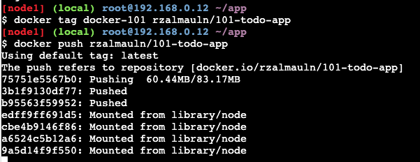

15. kemudian buat new instance di terminal pwd dan jalankan image yang tadi sudah dipush ke repo

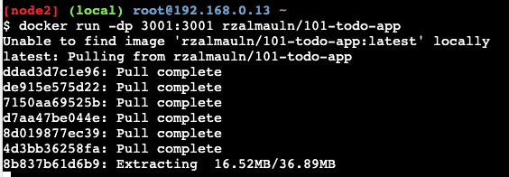

16. ini hasilnya jika berhasil
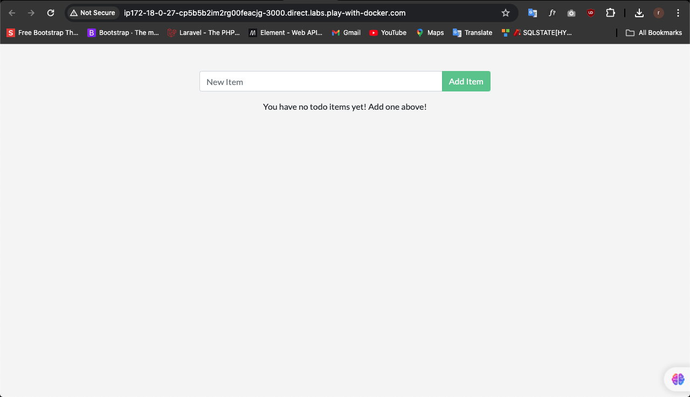

17. lakukan kode dibawah ini
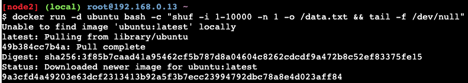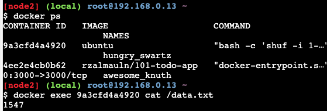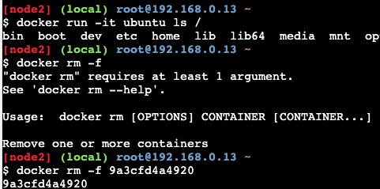

18. membuat sebuah volume guna tetap menyimpan data jika image terhapus
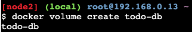
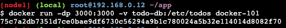
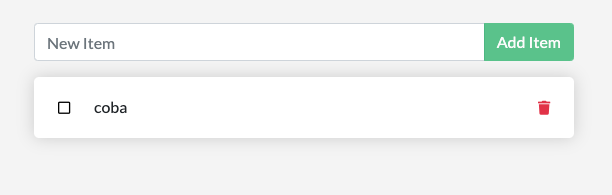
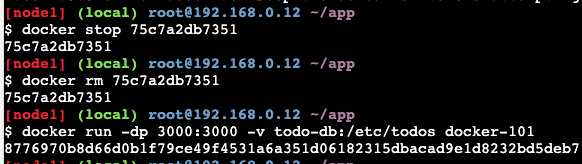

19. jika ingin melihat detail volume yang sudah dibuat dengan kode dibawah ini
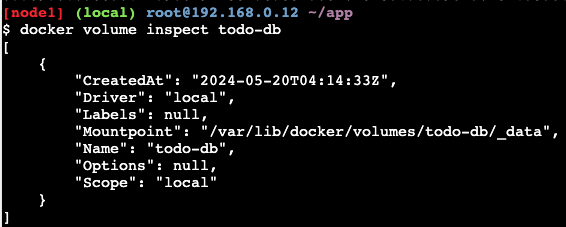
