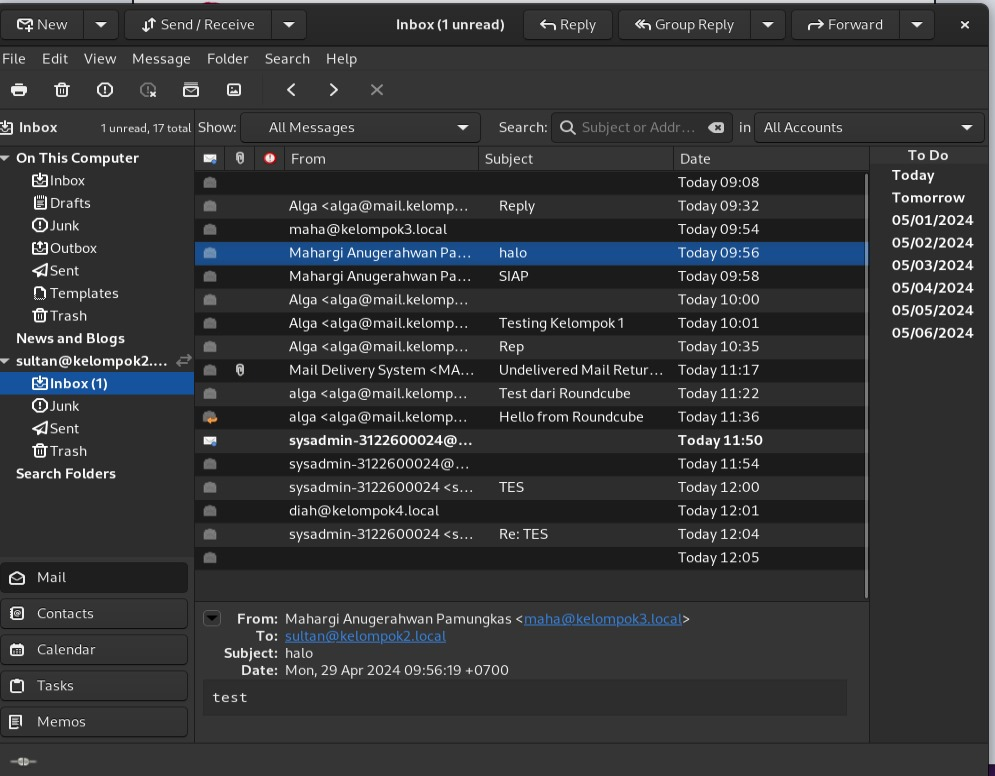
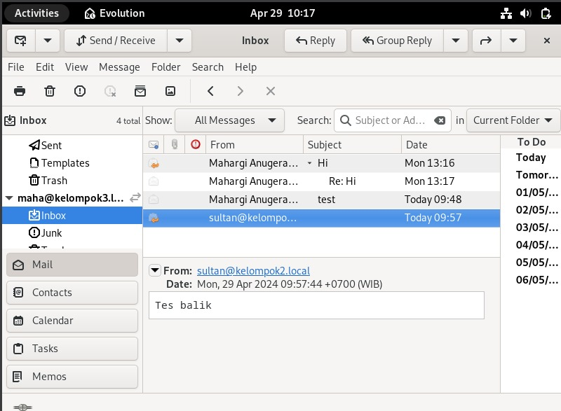
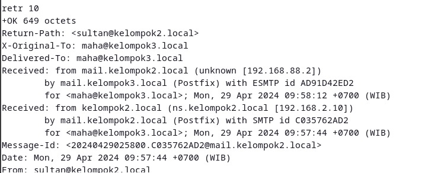

    NRP   : 3122600004
    Nama  : Rizal Maulana
    Kelas : 2 D4 IT A
    Dosen : Dr. Ferry Astika Saputra, ST, M.Sc

## Table of Contents
- [Sending Mail to Another Group](#langkah---langkah)
- [Install Roundcube](#roundcube)

# Langkah - langkah

1. Pertama pastikan resolv.conf terdapat search kelompok3.local, setelah itu masukkan perintah telnet mail.kelompok3.local 25 untuk mengirim pesan
   ke kelompok lain
2. Setelah itu ketikkan 
   MAIL FROM: <pengirim@kelompok3.local>

   RCPT TO:<penerima@kelompok2.local>

   DATA
   halo saya dari kelompok3.local

   . (untuk mengakhiri session ngirim email: . kemudian enter)

   QUIT (untuk mengakhiri session email)

3. Kemudian cek mail di device penerima dengan 2 cara melalui evolution atau menggunakan terminal:
   1. Buka melalui evolution, pastikan akun yang terlogin sesuai dengan yang menerima email kemudian cek pada inbox jika berhasil menerima mail
      maka akan muncul seperti ini:
      
      Menerima mail dari kelompok3.local:

      

      Menerima mail dari kelompok2.local:

      

   2. Kemudian jika kita cek pada terminal menggunakan perintah
      telnet kelompok3.local 110
      
      user username (sesuaikan dengan username di debian)
      
      pass password (sesuaikan dengan password di debian)
      
      list (memunculkan list email yang ada di debian)
      
      retr nomerlist (ganti nomerlist sesuai dengan mail yang ingin diperiksa)
      
      quit (jika dirasa sudah cukup)
      
      

   # Roundcube
   
1. Install with `sudo apt install roundcube`
   
   
   
   

2. Membuat Database User di MariaDB
   
   

3. Konfigurasi
   
   
   
   
   
   
   
   
   
   
   
   
   
   
   
   
   
   
   
   

4. Final Check
   
   
   
   
