# **Dasar Sistem Administrasi**

    NRP   : 3122600004
    Nama  : Rizal Maulana
    Kelas : 2 D4 IT A
    Dosen : Dr. Ferry Astika Saputra, ST, M.Sc

---

# Sumber Perangkat Lunak

 Debian GNU/Linux menggunakan metodologi repository untuk mendistribusi aplikasinya. metodologi ini menggunakan centralisasi software dan menggunakan tampilan untuk mengelola dan mengupgrade sistem kita.

---

## file sources.list

Alamat internet repositori debian disimpan difile **/etc/apt/sources.list**, detailnya tipe filenya **/etc/apt/sources.list.d/xxx.list**. 
untuk memodifikasi file sources.list, kita bisa menggunakan command dibawah ini 

    apt edit-sources 
    nano /etc/apt/sources.list

---

## Tentang repositori, branch, dan bagian/komponen

Debian mengatur softwarenya kedalam packages didalam banyak repositori. repositori itu dipisahkan ke beberapa branch dan bagian/komponen. 

Ada 4 bagian di dalam repositori debian : 
- main : Paket tersebut mematuhi Pedoman Perangkat Lunak Bebas Debian (DFSG), yang menjamin kebebasan dan keterbukaannya.
- non-free-fireware : non-free-firewares termasuk secara default saat debian 12 terbit
- contrib : mematuhi DFSG dengan paket non-free
- non-free : tidak mematuhi aturan DFSG

**DFSG** (Debian Free Software Guidelines) : filosofi prinsip dari perangkat lunak bebas menurut debian

---

## Backport Packages 
Debian juga menyediakan repositori spesial yang bernama backport. backport berisi beberapa aplikasi dengan versi terbaru. repositori ini secara default tidak aktif, tapi tidak menimbul resiko disistem kita. 

mekanisme backport mengizinkan aplikasi di debian development repositori untuk di rombak ulang menjadi versi yang stabil

---

## Memodifikasi Repositori

Untuk memodifikasi cukup edit file sources.list

    apt edit-sources

---

# APT di Terminal

APT (Advanced Package Tool), Debian juga support "aptitude", package manager lain, dengan syntax dan perilaku yang berbeda 

## Perintah untuk pencarian dan menampilkan informasi

| Perintah || Deskripsi |
|---|---|---|
| apt show foo | | menampilkan informasi tentang package |
| apt search foo || mencari package yang sesuai dengan yang dicari |
| apt-cache policy foo || menampilkan versi yang tersedia |
| apt full-upgrade || update paket yang terinstall, dengan menambahkan/menghapus paket yang diperlukan |
| apt remove foo || menghapus paket foo, tapi tidak dengan file konfigurasi |
| apt autoremove || auto menghapus paket yang tidak dibutuhkan |
| apt purge foo || membersihkan paket foo dan file konfigurasinya |
| apt clean || membersihkan local cache dari instalasi paket |
| apt autoclean || membersihkan local cache dari absolute paket |
| apt-mark showmanual || menandai paket agar instalasinya manual |

---

# Software : Simplifikasi Package Manager

Di debian ada aplikasi **Software** yang berguna untuk searching, install, delete atau update paket paket yang berisi aplikasi kita, 

---

# Discover: the KDE Package Manager

Gnome menggunakan software untuk me-manage aplikasi dengan cara sederhana, yaitu "Discover".

Discover dapat membantu kita untuk search, remove, atau update aplikasi kita dari satu interface. Kita juga dapat memodifikasi software source kita. (Secara mudah, Discover bekerja seperti Play Store)

Untuk membuka Discover, cukup masuk ke main menu > Application > System > Software Center > Discover

---

# Discovery Interface

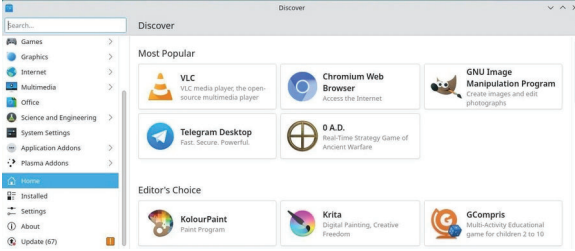

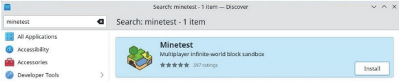

---

# Discovery Interface

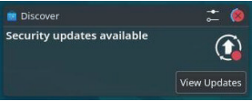

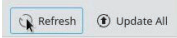

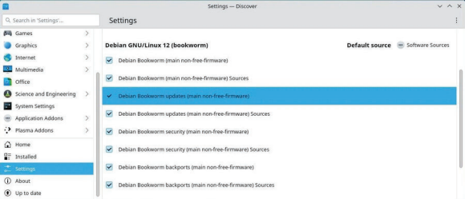

---

# Synaptic: the Comprehensive Package Manager

Synaptic adalah comprehensive graphical interface milik debian package manager

Ini memungkinkan untuk melihat total dari packages yang dipilih, baik terinstall maupun yang belum. Ini jauh lebih detail darpiada Discovery karena Synaptic menampilkan set lengkap packages yang tersedia. (termasuk libraries-nya)

---

# Synaptic Interface

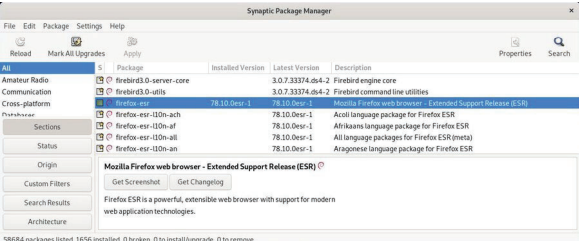

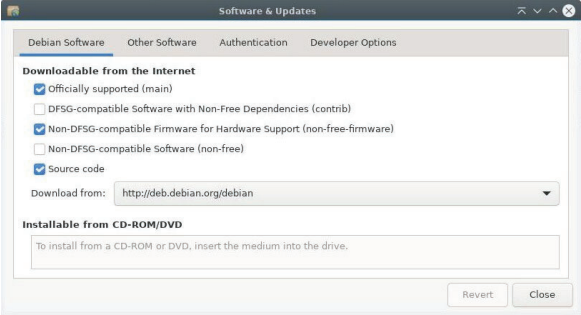

---

# Synaptic Interface

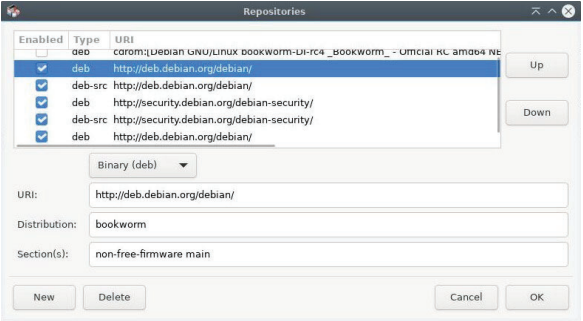

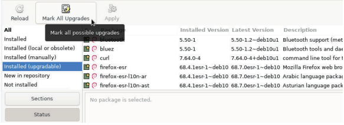

---

# Synaptic Interface

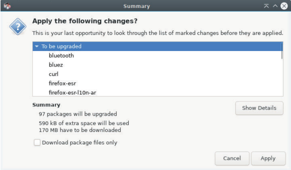

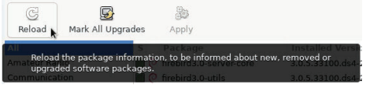

---

# Cleaning the System

Sebelum ke bagian cleaning, terdapat beberapa tools untuk mengetahui ruang yang digunakan dalam disk.

Kita bisa menggunakan terminal dengan `df -h` atau Disk Usage Analytics, application langsung dari debian.

---

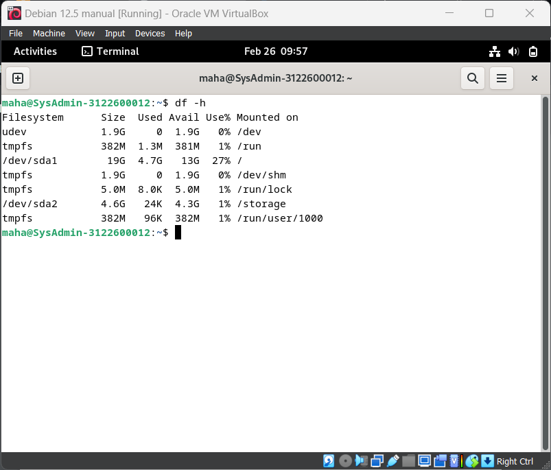

---

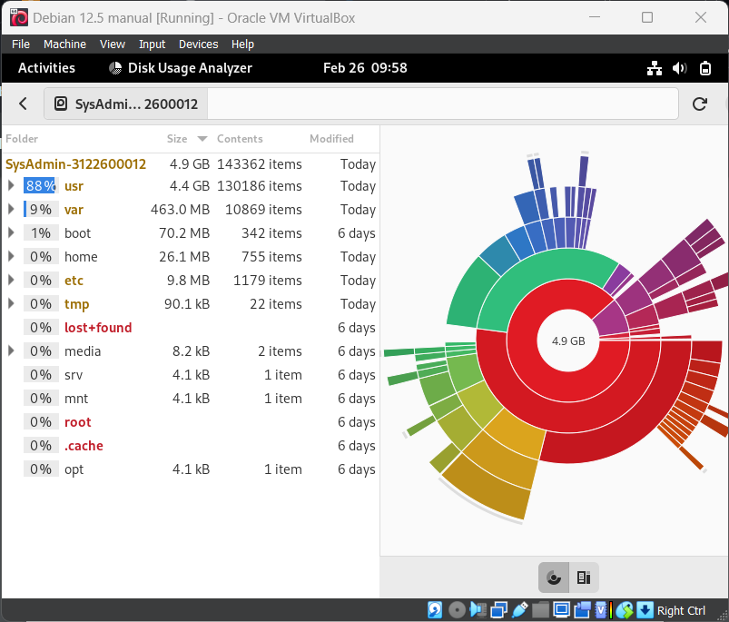

---

# Cleaning Procedures

Untuk membersihkan disk kita, kita akan memulai dari langkah pertama, yaitu:

## Cleaning the Packages :

using terminal

`apt clean`
`apt autoremove --purge`
`aot list ?obsolete`
`apt remove '?obsolete`

---

# Cleaning Procedures

## Emptying the Trash Bins :

using terminal

`rm -Rf ~/.local/share/Trash/*` > user wastebasket
`rm -Rf /root/.local/share/Trash/*` > admin wastebasket
`/media/your_id/your_disk/.Trash_1000` > external wastebasket

---

# Cleaning Procedures

## Purging Application Caches :

using terminal
`rm -Rm ~/.cache/*`

## Purging the thumbnails :

using terminals
`rm -Rf ~/.thumbnails`

---

# Paket .deb

deb adalah kependekan dari Debian. Untuk mendistribusikan softwarenya, Debian menggunakan format file arsip berupa .deb. .deb merupakan suatu format untuk mengkompres banyak file pada Debian seperti .zip pada Windows.

---

# Install di graphic mode dengan GDebi

GDebi merupakan graphical utility dimana dapat melakukan instalasi package dengan format .deb. Untuk install GDebi lakukan apt update && apt install gdebi menggunakan mode "su". Untuk menggunakan GDebi klik kanan pada file .deb lalu klik "Open with gdebi"

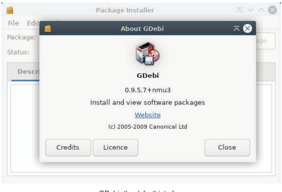

---

Kemudian klik Install Package untuk menginstall Package.

Lalu tunggu hingga proses selesai.

---

Untuk menghapus package klik Remove Package

---

# Install di terminal menggunakan Dpkg

Untuk menginstall external package gunakan:

dpkg -i package_name.deb

Tetapi akan muncul pesan error dimana dependencies tidak tersedia. untuk mengatasinya lakukan:

apt install dependency_1 dependency_2 ... (sesuai kebutuhan)

kemudian lakukan ulang dpkg -i package_name.deb

dan untuk menghapusnya lakukan dpkg --purge package_name

---

# Flatpak

Flatpak adalah sistem aplikasi virtualisasi untuk distribusi GNU/Linux. Tujuannya adalah menyediakan lingkungan "sandbox" yang aman, terisolasi dari sistem utama, di mana pengguna dapat menjalankan aplikasi yang tidak divalidasi oleh repositori distribusi (misalnya, versi uji coba). Aplikasi yang diunduh dari repositori Debian adalah arsip berformat ".deb" yang berisi aplikasi itu sendiri. Aplikasi ini menggunakan dependensi umum, saling terhubung, dan memiliki akses ke seluruh sistem Anda. Repositori Debian aman, jadi tidak perlu khawatir tentang masalah ini. Namun, mengapa kita harus menggunakan Flatpak? Format Flatpak bekerja secara berbeda: aplikasi dikompresi bersama dengan semua dependensinya, menjadikannya sepenuhnya independen dari sistem di mana ia diinstal. Dengan demikian, di sini Anda dapat menginstal dan menggunakan aplikasi yang diperbarui secara segar atau bahkan yang baru, dibandingkan dengan repositori Debian.

---

# Install Flatpak

Untuk melakukan instalisasi Flatpak masukkan perintah

sudo apt install flatpak

---

# Menambahkan sebuah Repository Flatpak

Untuk menambahkan repository seperti flathub contohnya lakukan

flatpak remote-add flathub https://flathub.prg/repo/flathub.flatpakrepo

---

# Memanage aplikasi Flatpak menggunakan Gnom dengan Software

Untuk mengambil keuntungan dari managing flatpaks tanpa menggunakan software manager, kita harus menambahkan plugin yang sesuai dengan enviornment kita. Untuk Gnome kita dapat menginstallnya dengan perintah

sudo apt install gnome-software-plugin-flatpak

---

# Memanage aplikasi Flatpak menggunakan KDE dengan Discover

Untuk menggunakan KDE dalam hal memanage aplikasi Flatpak kita dapat menginstallnya menggunakan perintah

sudo apt install plasma-discover-backend-flatpak

---

# Memanage aplikasi Flatpak menggunakan terminal

List perintah:

flatpak search flaptak_name: untuk mencari sebuah flatpak di semua repositories

flatpak install repository flatpak_name: menginstall flatpak dari repository

flatpak uninstall flatpak_name: menghapus flatpak

flatpak uninstall -unused: menghapus dependencies yang tidak terpakai

flatpak update: melakukan update semua flatpak yang terinstall

flatpak run flatpak_name: menjalankan flatpak

---

# Siapa sid guy?

Secara singkat, Debian memiliki beberapa cabang distribusi yang berjalan sejajar, yaitu oldstable, stable, testing, dan unstable, serta cabang eksperimental. Distribusi Stable adalah distribusi resmi Debian yang dirilis pada saat ini, yang dipelihara dan diperbarui oleh tim Debian. Perubahan yang dilakukan hanya berkaitan dengan pembaruan keamanan dan perbaikan bug. Disarankan untuk menggunakan versi ini. Distribusi Oldstable adalah versi stabil sebelumnya yang biasanya didukung oleh tim Debian selama satu tahun setelah rilis versi stabil baru. Namun, bisa bertahan lebih lama jika cukup banyak individu atau perusahaan yang melanjutkan pemeliharaannya. Distribusi Testing adalah versi Stable masa depan yang digunakan untuk mempersiapkan versi stabil berikutnya. Distribusi Unstable, yang disebut Sid, adalah versi yang menerima semua versi paket baru dan berada di ujung inovasi, tetapi tidak sangat stabil. Ini adalah laboratorium penelitian. Distribusi Eksperimental bukanlah distribusi Debian yang sebenarnya, tetapi merupakan repositori di mana versi perangkat lunak alpha atau beta diuji.