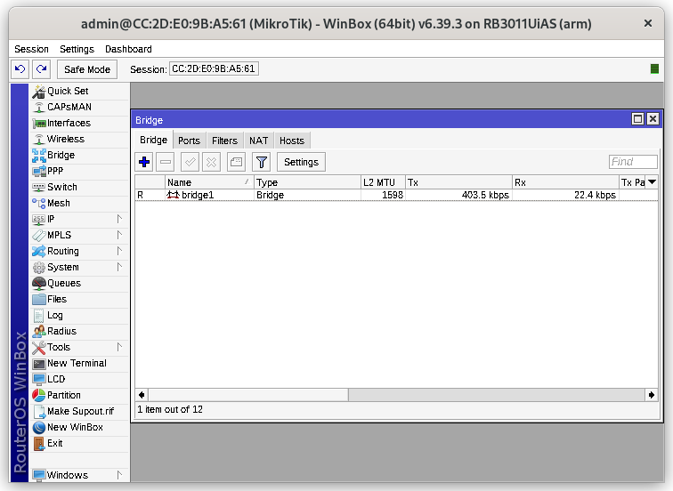
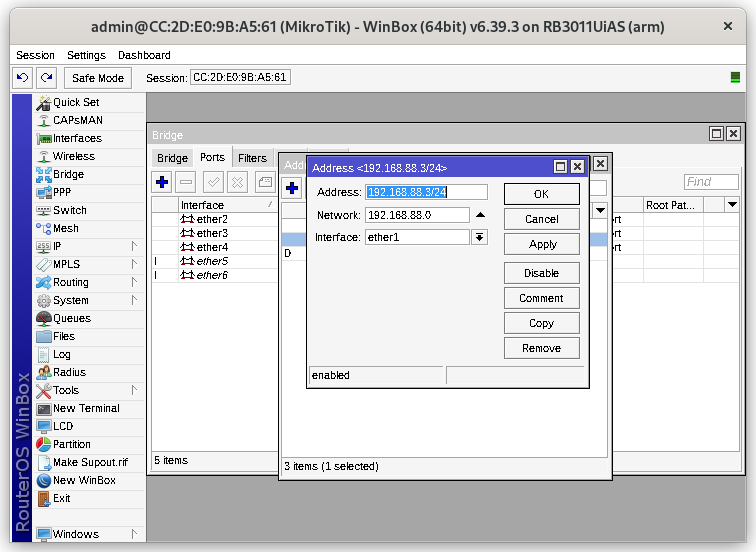
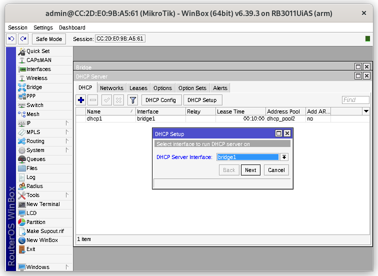
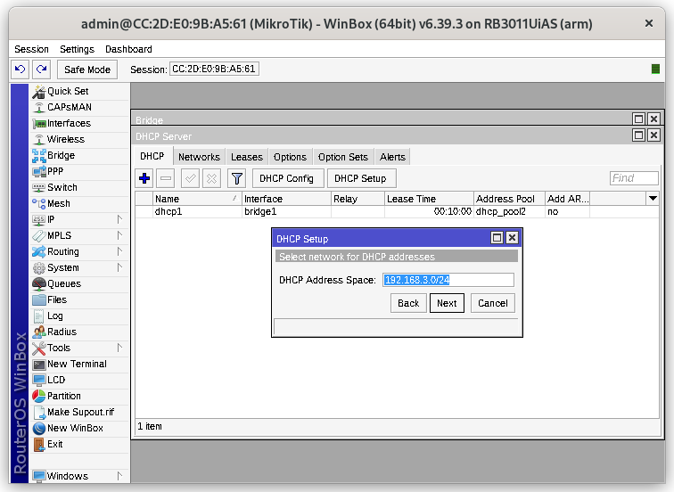
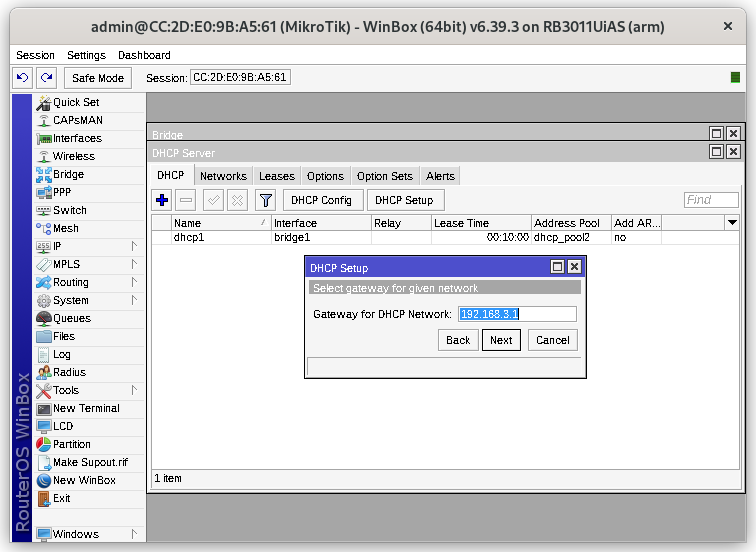
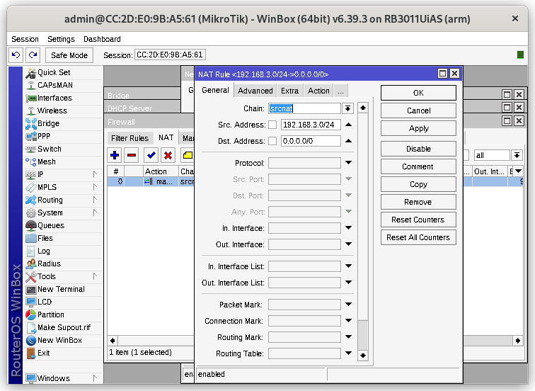
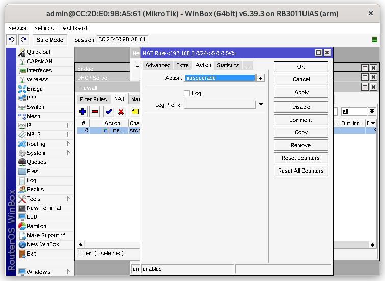

    NRP   : 3122600004
    Nama  : Rizal Maulana
    Kelas : 2 D4 IT A
    Dosen : Dr. Ferry Astika Saputra, ST, M.Sc

# Step By Step Setting Windbox Mikrotik

sebelum melakukan setting winbox mikrotik, perlu melakukan riset jika sudah pernah disetting sebelumnya

1. Login ke Winbox dengan username yang ada di mikrotik
2. Buat brige1

3. Buat port ether 2 - 10

4. Buat Address list 
    - Address 192.168.3.1 network 192.168.3.0 interface bridge1 
    
    - Address 192.168.88.3 network 192.168.88.0 interface ether1
    
5. DCHP Setup 
    - Server interface bridge1 
    
    - Address space 192.168.88.0/24
    
    - Gateway 192.168.88.254
    
    - Address give out 192.168.88.100 - 192.168.88.200
    - DNS 202.9.85.3
6. Firewall -> NAT
    - Scr address 192.168.3.0/24 & Dst Address 0.0.0.0/0
    
    - Action masquerade	
    
